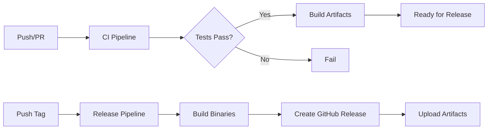

# CI/CD Pipeline Documentation

## Overview

The UpCloud DevPod Provider uses GitHub Actions for continuous integration and delivery. Our CI/CD pipeline ensures code quality, automated testing, and streamlined releases across multiple platforms.

## Architecture



## GitHub Actions Workflows

### 1. CI Pipeline (`ci.yml`)

**Trigger:** Push to main branch, Pull Requests

**Purpose:** Validates code quality and functionality

**Jobs:**
- **Lint** - Code style and quality checks
  - Uses golangci-lint v2.4.0
  - Configuration in `.golangci.yml`
  - Checks: govet, ineffassign, staticcheck, unused

- **Test** - Runs all test suites
  - Unit tests: `make test`
  - BDD tests: `make bdd` (with Cucumber/Godog)
  - Coverage report generation
  - Upload to Codecov

- **Build** - Validates compilation
  - Multi-platform build verification
  - Linux, macOS, Windows (amd64/arm64)

**Environment Variables:**
```yaml
GO_VERSION: '1.25'
```

### 2. Release Pipeline (`release.yml`)

**Trigger:** Git tags matching `v*` pattern

**Purpose:** Automated binary releases and distribution

**Process:**
1. **Test** - Runs full test suite to ensure quality
2. **Build** - Uses GoReleaser to create binaries:
   - Linux (amd64, arm64)
   - macOS (amd64, arm64)
   - Windows (amd64)
3. **Calculate Checksums** - SHA256 for each binary
4. **Update provider.yaml** - Inserts version and checksums
5. **Create GitHub Release** - Uploads all artifacts
6. **Notify** - Success/failure notification

**Artifacts Created:**
- Binary executables for each platform
- `provider.yaml` with checksums
- Release notes from commit messages

### 3. Docker Pipeline (`docker.yml`)

**Trigger:**
- Push to main branch
- Git tags matching `v*`
- Manual dispatch

**Purpose:** Build and publish container images

**Images Built:**
- `ghcr.io/neuralmux/devpod-provider-upcloud:latest`
- `ghcr.io/neuralmux/devpod-provider-upcloud:<version>`

**Platforms:**
- linux/amd64
- linux/arm64

### 4. Dependabot Auto-Merge (`dependabot-auto-merge.yml`)

**Trigger:** Dependabot pull requests

**Purpose:** Automatically merge dependency updates

**Conditions:**
- Minor and patch updates only
- All CI checks must pass
- Automatic approval and merge

## Build Process

### Local Builds

```bash
# Standard build
make build

# Cross-platform builds with GoReleaser
goreleaser build --snapshot --clean

# Specific platform
GOOS=linux GOARCH=amd64 go build -o bin/devpod-provider-upcloud
```

### CI/CD Builds

The CI/CD pipeline uses GoReleaser for consistent, reproducible builds:

```yaml
# .goreleaser.yml configuration
builds:
  - id: provider
    binary: devpod-provider-upcloud
    env:
      - CGO_ENABLED=0
    ldflags:
      - -s -w
      - -X main.version={{.Version}}
      - -X main.commit={{.Commit}}
```

## Testing Strategy

### Test Levels

1. **Unit Tests** (`pkg/`, `cmd/`)
   - Fast, isolated component tests
   - No external dependencies
   - Run with: `make test`

2. **BDD Tests** (`features/`)
   - Behavior-driven scenarios
   - Uses Cucumber/Godog
   - Tests provider commands end-to-end
   - Run with: `make bdd`

3. **Integration Tests**
   - Tagged with `integration` build tag
   - Test with mock UpCloud API
   - Run with: `go test -tags=integration`

### Test Coverage

- Minimum coverage: Not enforced (best effort)
- Coverage reports uploaded to Codecov
- View coverage: `make coverage`

### Test Environment

Tests run in "test mode" when credentials are set to:
```bash
export UPCLOUD_USERNAME="test"
export UPCLOUD_PASSWORD="test"
```

This enables testing without real API calls.

## Quality Gates

### Pre-Merge Requirements

All pull requests must pass:

1. **Linting** - No golangci-lint errors
2. **Unit Tests** - 100% pass rate
3. **BDD Tests** - All scenarios passing
4. **Build Verification** - Successful compilation
5. **DCO** - Signed-off commits (if required)

### Pre-Release Requirements

Before creating a release tag:

1. All CI checks passing on main branch
2. Updated CHANGELOG.md (if maintaining one)
3. Version bump in relevant files
4. Tested manually with real UpCloud account

## Configuration Files

### `.golangci.yml`

Configures linting rules:
```yaml
version: "2"
linters:
  enable:
    - govet
    - ineffassign
    - staticcheck
    - unused
```

### `.goreleaser.yml`

Defines build and release configuration:
- Binary naming
- Platform targets
- Archive formats
- Checksum generation

### `Makefile`

Provides standard development commands:
```bash
make build      # Build binary
make test       # Run unit tests
make bdd        # Run BDD tests
make test-all   # Run all tests
make lint       # Run linter
make fmt        # Format code
```

## Environment Variables

### CI Environment

| Variable | Description | Used In |
|----------|-------------|---------|
| `GO_VERSION` | Go version for builds | All workflows |
| `GITHUB_TOKEN` | Authentication for GitHub API | Release workflow |
| `UPCLOUD_USERNAME` | Test mode username ("test") | Test jobs |
| `UPCLOUD_PASSWORD` | Test mode password ("test") | Test jobs |

### Secrets

Required GitHub repository secrets:
- `GITHUB_TOKEN` - Automatically provided by GitHub Actions

## Troubleshooting

### Common Issues

#### 1. Linting Failures

**Problem:** golangci-lint reports errors
```
Error return value not checked (errcheck)
```

**Solution:**
- Fix the specific linting issues
- Or update `.golangci.yml` to adjust rules
- Use `_ = ` for intentionally ignored errors

#### 2. BDD Test Failures

**Problem:** Null pointer in test mode
```
panic: runtime error: invalid memory address
```

**Solution:**
- Ensure test mode checks in client code
- Verify environment variables are set
- Check mock client implementation

#### 3. Release Workflow Failures

**Problem:** Release fails to upload artifacts
```
Error: Resource not accessible by integration
```

**Solution:**
- Verify GITHUB_TOKEN permissions
- Check tag format matches `v*` pattern
- Ensure all tests pass before tagging

#### 4. GoReleaser Issues

**Problem:** Build fails with GoReleaser
```
only version: 2 configuration files are supported
```

**Solution:**
- Ensure `.goreleaser.yml` has `version: 2`
- Run `goreleaser check` locally
- Update GoReleaser if needed

### Debugging Workflows

1. **View Workflow Logs**
   ```bash
   gh run list --workflow=ci.yml
   gh run view <run-id>
   ```

2. **Re-run Failed Jobs**
   ```bash
   gh run rerun <run-id>
   ```

3. **Test Locally**
   ```bash
   # Run with act (GitHub Actions locally)
   act -W .github/workflows/ci.yml
   ```

## Best Practices

1. **Always run tests before pushing**
   ```bash
   make pre-push
   ```

2. **Keep workflows DRY**
   - Use composite actions for repeated steps
   - Define common variables in env section

3. **Version pinning**
   - Pin action versions (e.g., `actions/checkout@v4`)
   - Pin tool versions in workflows

4. **Security**
   - Never commit credentials
   - Use GitHub secrets for sensitive data
   - Regularly update dependencies

5. **Performance**
   - Use workflow caching for dependencies
   - Parallelize independent jobs
   - Optimize test execution time

## Monitoring

### Workflow Status

- Dashboard: [Actions tab](https://github.com/neuralmux/devpod-provider-upcloud/actions)
- Badge: 

### Metrics to Track

- Build time trends
- Test execution time
- Release success rate
- Dependency update frequency

## Future Improvements

Potential enhancements to consider:

- [ ] Add semantic release automation
- [ ] Implement changelog generation
- [ ] Add performance benchmarks
- [ ] Set up branch protection rules
- [ ] Add security scanning (SAST/SCA)
- [ ] Implement release candidate builds
- [ ] Add macOS code signing
- [ ] Set up nightly builds