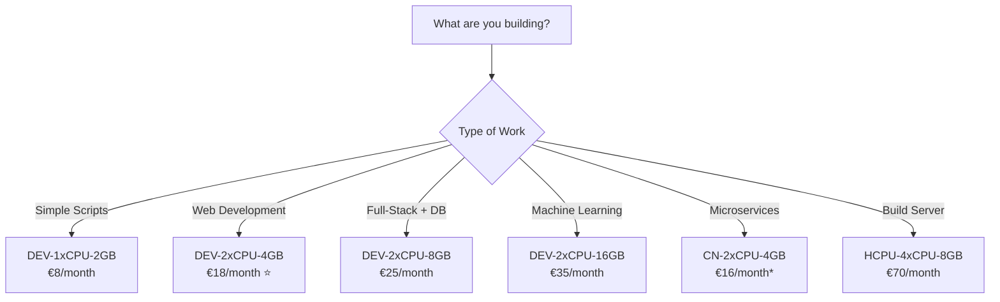

# UpCloud Server Plans for DevPod

> 💰 **Save up to 89% on development costs** with UpCloud's new Developer Plans designed specifically for cloud development workspaces.

## Table of Contents

- [Overview](#overview)
- [Quick Start](#quick-start)
- [Plan Categories](#plan-categories)
  - [Developer Plans (Recommended)](#developer-plans-recommended)
  - [Cloud Native Plans](#cloud-native-plans)
  - [General Purpose Plans](#general-purpose-plans)
  - [High CPU Plans](#high-cpu-plans)
  - [High Memory Plans](#high-memory-plans)
- [Choosing the Right Plan](#choosing-the-right-plan)
- [Cost Comparison](#cost-comparison)
- [Using the Plans Command](#using-the-plans-command)
- [Configuration](#configuration)
- [Migration Guide](#migration-guide)
- [FAQ](#faq)

## Overview

The UpCloud DevPod provider uses a flexible templating system that makes it easy to select the perfect server plan for your development needs. With the introduction of UpCloud's Developer Plans in September 2024 and Cloud Native Plans in December 2024, you can now run development workspaces at a fraction of the previous cost.

### Key Benefits

- 🎯 **Smart Defaults**: Automatically uses the most cost-effective plan (DEV-2xCPU-4GB)
- 💸 **Massive Savings**: Developer plans start at just €3/month
- 🔄 **Pay-as-you-go**: Cloud Native plans bill only when powered on
- 📊 **Easy Discovery**: Built-in `plans` command shows all available options
- 🚀 **Future-proof**: Templating system adapts to new UpCloud offerings

## Quick Start

```bash
# List all recommended plans with pricing
devpod-provider-upcloud plans --recommended

# Create a workspace with the default Developer plan (€18/month)
devpod up . --provider upcloud

# Use a specific plan
devpod provider set-options upcloud --option UPCLOUD_PLAN=DEV-2xCPU-8GB
devpod up . --provider upcloud
```

## Plan Categories

### Developer Plans (Recommended)

**Best for:** Development workspaces, testing, learning, and prototyping
**Cost:** €3-35/month
**Special:** Optimized pricing for developers, restricted instance counts on smallest plans

| Plan ID | Specs | Storage | Price | Best For | Restrictions |
|---------|-------|---------|-------|----------|--------------|
| **DEV-1xCPU-1GB-10GB** | 1 CPU, 1GB RAM | 10GB | €3/mo | Documentation, light editing | Max 2/account |
| **DEV-1xCPU-1GB** | 1 CPU, 1GB RAM | 20GB | €4.50/mo | Simple scripts, testing | Max 5/account |
| **DEV-1xCPU-2GB** | 1 CPU, 2GB RAM | 30GB | €8/mo | Frontend dev, simple APIs | - |
| **DEV-1xCPU-4GB** | 1 CPU, 4GB RAM | 40GB | €15/mo | Full-stack development | - |
| **DEV-2xCPU-4GB** ⭐ | 2 CPU, 4GB RAM | 60GB | €18/mo | **DEFAULT** - Web/API dev | - |
| **DEV-2xCPU-8GB** | 2 CPU, 8GB RAM | 80GB | €25/mo | Professional development | - |
| **DEV-2xCPU-16GB** | 2 CPU, 16GB RAM | 100GB | €35/mo | Heavy workloads, ML dev | - |

#### Why Developer Plans?

- **36-89% cheaper** than General Purpose plans with similar specs
- **Optimized for development** with AMD EPYC processors
- **Flexible storage** included in the price
- **Perfect for DevPod** auto-shutdown feature saves even more

### Cloud Native Plans

**Best for:** Containerized workloads, microservices, Kubernetes development
**Cost:** €2.50-16/month (billed only when powered on!)
**Special:** Pay-per-use billing, storage configured separately

| Plan ID | Specs | Price | Hourly | Best For |
|---------|-------|-------|--------|----------|
| **CN-1xCPU-0.5GB** | 1 CPU, 512MB RAM | €2.50/mo | €0.0035/hr | Microservices |
| **CN-1xCPU-1GB** | 1 CPU, 1GB RAM | €4/mo | €0.0056/hr | Small containers |
| **CN-2xCPU-2GB** | 2 CPU, 2GB RAM | €12/mo | €0.017/hr | App servers |
| **CN-2xCPU-4GB** | 2 CPU, 4GB RAM | €16/mo | €0.022/hr | Dev workspaces |

#### Cloud Native Advantages

- **Pay only when running** - Perfect with DevPod's auto-shutdown
- **No storage costs when stopped** - Configure storage separately
- **Ideal for ephemeral workspaces** - Spin up/down as needed
- **Kubernetes-ready** - Designed for container workloads

### General Purpose Plans

**Best for:** Production workloads, stable environments
**Cost:** €7-672/month
**Note:** Higher cost than Developer plans, consider only for production

| Plan ID | Specs | Storage | Price | vs Developer |
|---------|-------|---------|-------|--------------|
| 1xCPU-1GB | 1 CPU, 1GB RAM | 25GB | €7/mo | +56% vs DEV |
| 2xCPU-4GB | 2 CPU, 4GB RAM | 80GB | €28/mo | +56% vs DEV |
| 4xCPU-8GB | 4 CPU, 8GB RAM | 160GB | €56/mo | +124% vs comparable DEV |
| 8xCPU-32GB | 8 CPU, 32GB RAM | 640GB | €224/mo | For production only |

### High CPU Plans

**Best for:** Compute-intensive tasks, build servers, CI/CD
**Cost:** €35-280/month

Ideal for:
- Continuous Integration/Deployment
- Code compilation
- Video encoding/processing
- Scientific computing
- 3D rendering

### High Memory Plans

**Best for:** Memory-intensive applications, large databases
**Cost:** €70-560/month

Ideal for:
- In-memory databases
- Big data processing
- Large-scale analytics
- Memory caching layers

## Choosing the Right Plan

### By Use Case


*Cloud Native plans bill only when powered on

### By Programming Language

| Language | Recommended Plan | Monthly Cost | Rationale |
|----------|-----------------|--------------|-----------|
| **JavaScript/TypeScript** | DEV-2xCPU-4GB | €18 | Node.js, npm, build tools |
| **Python** | DEV-2xCPU-8GB | €25 | Data libraries, Jupyter |
| **Java/Spring** | DEV-2xCPU-16GB | €35 | JVM memory requirements |
| **Go** | DEV-2xCPU-4GB | €18 | Efficient resource usage |
| **Rust** | DEV-2xCPU-8GB | €25 | Compilation needs |
| **PHP** | DEV-2xCPU-4GB | €18 | LAMP/LEMP stack |
| **Ruby/Rails** | DEV-2xCPU-8GB | €25 | Bundle, assets, DB |
| **.NET** | DEV-2xCPU-8GB | €25 | Visual Studio Code Server |

### By Team Size

- **Solo Developer**: DEV-1xCPU-4GB (€15/mo)
- **Small Team**: DEV-2xCPU-4GB (€18/mo)
- **Professional Team**: DEV-2xCPU-8GB (€25/mo)
- **Enterprise Team**: DEV-2xCPU-16GB (€35/mo) or custom

## Cost Comparison

### Monthly Savings Analysis

| Workload | Old Plan (GP) | New Plan (DEV) | Monthly Saving | Annual Saving |
|----------|---------------|----------------|----------------|---------------|
| Basic Dev | 1xCPU-1GB (€7) | DEV-1xCPU-1GB (€4.50) | €2.50 (36%) | €30 |
| Standard Dev | 2xCPU-4GB (€28) | DEV-2xCPU-4GB (€18) | €10 (36%) | €120 |
| Pro Dev | 4xCPU-8GB (€56) | DEV-2xCPU-8GB (€25) | €31 (55%) | €372 |
| Heavy Dev | 8xCPU-32GB (€224) | DEV-2xCPU-16GB (€35) | €189 (84%) | €2,268 |

### With Auto-Shutdown (10 hours/day usage)

Assuming workspace runs 10 hours per workday (220 days/year):

| Plan | Full Month Cost | Actual Cost (42% usage) | Annual with Auto-shutdown |
|------|-----------------|-------------------------|---------------------------|
| DEV-2xCPU-4GB | €18 | €7.56 | €90.72 |
| CN-2xCPU-4GB | €16 | €6.72* | €80.64 |

*Cloud Native plans only bill when powered on

## Using the Plans Command

The provider includes a powerful `plans` command for discovering and selecting server plans:

### Basic Usage

```bash
# List all available plans
devpod-provider-upcloud plans

# Show only recommended plans for DevPod
devpod-provider-upcloud plans --recommended

# Show plans from a specific category
devpod-provider-upcloud plans --category developer

# Get detailed information including use cases
devpod-provider-upcloud plans --detailed

# Output as JSON for scripting
devpod-provider-upcloud plans --format json

# Output as YAML for configuration
devpod-provider-upcloud plans --format yaml
```

### Example Outputs

#### Recommended Plans
```
🌟 Recommended Plans for DevPod
================================

  DEV-1xCPU-1GB-10GB   1 CPU, 1 GB RAM, 10 GB Storage - €3.00/month
  DEV-1xCPU-2GB        1 CPU, 2 GB RAM, 30 GB Storage - €8.00/month
★ DEV-2xCPU-4GB        2 CPU, 4 GB RAM, 60 GB Storage - €18.00/month [DEFAULT]
  DEV-2xCPU-8GB        2 CPU, 8 GB RAM, 80 GB Storage - €25.00/month
```

#### Category View
```bash
$ devpod-provider-upcloud plans --category developer --detailed

🚀 Developer Plans
=====================================
⭐ Recommended for DevPod
Cost-effective plans optimized for development workspaces

  ★ DEV-2xCPU-4GB      2 CPU, 4 GB RAM, 60 GB Storage - €18.00/month [DEFAULT] [RECOMMENDED]
       Recommended for most developers
       Use cases: Web development, API development, Docker development

  DEV-2xCPU-8GB        2 CPU, 8 GB RAM, 80 GB Storage - €25.00/month [RECOMMENDED]
       Professional development workspace
       Use cases: Large applications, Multiple containers, Databases
```

### Scripting with JSON Output

```bash
# Find the cheapest plan with at least 4GB RAM
devpod-provider-upcloud plans --format json | \
  jq '.[] | select(.ram_mb >= 4096) | .id + ": €" + (.price_monthly_eur | tostring) + "/mo"' | \
  sort -t':' -k2 -n | head -1

# Output: "DEV-1xCPU-4GB: €15/mo"
```

## Configuration

### Setting Your Plan

1. **During Provider Setup**:
```bash
devpod provider add github.com/neuralmux/devpod-provider-upcloud
devpod provider set-options upcloud --option UPCLOUD_PLAN=DEV-2xCPU-8GB
```

2. **For Existing Provider**:
```bash
devpod provider set-options upcloud --option UPCLOUD_PLAN=DEV-2xCPU-16GB
```

3. **Per Workspace**:
```bash
devpod up . --provider upcloud --provider-option UPCLOUD_PLAN=CN-2xCPU-4GB
```

4. **Via Environment Variables**:
```bash
export UPCLOUD_PLAN=DEV-2xCPU-8GB
devpod up . --provider upcloud
```

### Configuration Examples

#### Budget Development Setup
```yaml
# Minimal cost for light development
UPCLOUD_PLAN: DEV-1xCPU-2GB        # €8/month
UPCLOUD_ZONE: de-fra1               # Frankfurt
UPCLOUD_STORAGE: 30                 # 30GB included
INACTIVITY_TIMEOUT: 10m             # Auto-stop after 10 minutes
```

#### Professional Setup
```yaml
# Balanced performance and cost
UPCLOUD_PLAN: DEV-2xCPU-8GB        # €25/month
UPCLOUD_ZONE: us-nyc1               # New York
UPCLOUD_STORAGE: 80                 # 80GB included
INACTIVITY_TIMEOUT: 30m             # Auto-stop after 30 minutes
```

#### Cloud Native Setup
```yaml
# Pay only when running
UPCLOUD_PLAN: CN-2xCPU-4GB         # €16/month when on
UPCLOUD_ZONE: sg-sin1               # Singapore
UPCLOUD_STORAGE: 50                 # Configure separately
INACTIVITY_TIMEOUT: 5m              # Aggressive auto-stop
```

## Migration Guide

### From Legacy Plans to Developer Plans

If you're currently using General Purpose plans, here's how to migrate:

1. **Check Current Plan**:
```bash
devpod provider options upcloud | grep UPCLOUD_PLAN
```

2. **Find Equivalent Developer Plan**:
   - `1xCPU-1GB` → `DEV-1xCPU-1GB` (Save €2.50/month)
   - `2xCPU-4GB` → `DEV-2xCPU-4GB` (Save €10/month)
   - `4xCPU-8GB` → `DEV-2xCPU-8GB` (Save €31/month)

3. **Update Provider Configuration**:
```bash
devpod provider set-options upcloud --option UPCLOUD_PLAN=DEV-2xCPU-4GB
```

4. **Recreate Workspaces** (Required for plan change):
```bash
# Stop and delete old workspace
devpod stop my-workspace
devpod delete my-workspace

# Create with new plan
devpod up . --provider upcloud
```

### Backward Compatibility

The provider maintains backward compatibility with all legacy plan names:
- Old plans continue to work
- No breaking changes for existing configurations
- Gradual migration recommended for cost savings

## FAQ

### General Questions

**Q: Why are Developer Plans so much cheaper?**
A: UpCloud designed these specifically for development workloads with optimized resource allocation and pricing. They're perfect for DevPod's use case.

**Q: Can I use Developer Plans for production?**
A: While technically possible, they're optimized for development. Use General Purpose or High-Performance plans for production workloads.

**Q: What happens if I exceed plan restrictions?**
A: Some Developer Plans have account limits (e.g., max 2 instances of DEV-1xCPU-1GB-10GB). You'll get an error when trying to create more.

**Q: How do Cloud Native plans bill?**
A: They only charge for the time the server is running. When stopped, you pay nothing (except for any attached storage).

### DevPod-Specific Questions

**Q: What's the default plan if I don't specify one?**
A: DEV-2xCPU-4GB (€18/month) - a balanced plan suitable for most development work.

**Q: How does auto-shutdown save money?**
A: With INACTIVITY_TIMEOUT set, servers stop automatically when idle. Developer Plans still bill monthly, but Cloud Native plans stop billing entirely when stopped.

**Q: Can I change plans without recreating my workspace?**
A: No, UpCloud requires recreating the server to change plans. Use DevPod's workspace management to migrate data if needed.

**Q: Which plan is best for Docker development?**
A: DEV-2xCPU-4GB (default) for single containers, DEV-2xCPU-8GB for multiple containers or docker-compose setups.

### Troubleshooting

**Q: Error "invalid plan: XYZ"**
A: Run `devpod-provider-upcloud plans` to see valid plan IDs. Ensure you're using the exact ID (case-sensitive).

**Q: How do I know which plans are available in my region?**
A: All plans listed in this guide are available in all UpCloud regions. Use `devpod-provider-upcloud plans` to see current availability.

**Q: Can I create custom plans?**
A: No, but you can request new plans from UpCloud. The provider will automatically support new plans through its templating system.

## Summary

The UpCloud DevPod provider's templating system makes it easy to:
- 💰 **Save money** with Developer Plans (€3-35/month)
- 🎯 **Choose wisely** with the plans command and recommendations
- 🔄 **Stay flexible** with Cloud Native pay-as-you-go options
- 📈 **Scale easily** from minimal to heavy development workloads

Start with the default DEV-2xCPU-4GB plan and adjust based on your needs. Most developers will find the Developer Plans perfect for their DevPod workspaces while saving 36-89% compared to traditional cloud servers.

---

*Last updated: December 2024 | Provider version: 0.2.0*